# Concert Program

## About Iranian Classical Music

Iranian classical music is built around a sophisticated modal system called **dastgah**—think of these as musical universes, each with its own emotional character and melodic patterns yet deeply interconnected. Tonight's performance will take you on a journey through several of these musical worlds, from the majestic Esfahan to the contemplative Dashti.

---

## About Darya Ensemble

Darya, meaning "the sea" in Persian, was founded in 1996 through the artistic collaboration between Faraidoun Akhavan and Douglas Hensley. Originally formed as a cultural bridge between traditional Persian music and Canadian audiences, the ensemble has evolved into a sophisticated musical collective dedicated to preserving and reimagining the beauty of Persian classical music.

Named after Keivan Saket's evocative composition "The Sea," Darya embodies the dynamic, ever-changing nature of both the ocean and Persian musical tradition. As the group has grown over nearly three decades, it has welcomed accomplished musicians from diverse backgrounds, creating a rich tapestry of artistic voices united by their passion for Persian classical music.

The ensemble's repertoire spans the full spectrum of Persian musical forms, from traditional folk melodies to contemporary compositions, performed on traditional instruments including tar, setar, santour, ney, kamancheh, daf, and vocals. Through their performances across Victoria, Vancouver Island, and beyond, Darya has established itself as a vital cultural ambassador, introducing audiences to the sophisticated and profound emotional depth of Persian musical expression.

With this expansion of talent and instrumentation, Darya continues its mission of preserving classical Persian musical traditions while exploring innovative interpretations that speak to contemporary audiences. The ensemble represents both the timeless beauty of Persian culture and its living, breathing evolution in the Canadian artistic landscape.

---

## Part 1

- **Pishdaraamad-e Esfahaan**
  - Composer: Ali Asghar Bahari (1905-1995)
  - *A pishdaramad is an opening composition that introduces a dastgah's character. One of the 20th century's most revered kamanche masters, Bahari was renowned for his revolutionary approach to cross-modal improvisation and his ability to seamlessly weave between dastgahs with such skill that even expert listeners couldn't detect the transitions. This haunting pishdaramad is a masterpiece of emotional storytelling through melody. It begins with whispered contemplations, gradually awakening into passionate questioning, then soaring through moments of ecstatic discovery before settling into a profound, complex resolution—part frustration, part acceptance. Like reading the diary of a master musician's soul, it captures the eternal human struggle between longing and contentment, inviting you into an intimate musical conversation that will linger in your heart long after the final note.*

- **Tasnif-e Daryaa** (*The Sea*)
  - Composer: Keivan Saket (b. 1961)
  - *Tasnifs are rhythmic songs with poetry, often expressing themes of love, nature, or mysticism. The piece that lends its name to our ensemble, this vivid musical seascape captures the ocean's ever-changing moods with breathtaking realism. Beginning as a tranquil summer day by the shore, with gentle waves lapping and seabirds soaring across the horizon, the music gradually transforms into nature's drama. Saket masterfully paints the sea's growing restlessness—winds picking up, waves swelling into towering walls of water that could overturn ships, thunder crashing overhead, before finally returning to serene calm. The poetry warns us to remain as dynamic and alive as the sea itself, lest we become stagnant pools. The sea moves through every mood—gentle waves at sunrise, sudden storms that shake the horizon, then perfect stillness under scattered stars. The poet dreams of hearts that flow like tidewater, never settling into forgotten pools. Seeds scattered across desert sand, pearls hidden in the deepest currents, a soul as boundless and ever-changing as the waters themselves.*

- **Saaz-o Aavaaz-e Shushtari**
  - *Saaz-o Aavaaz are improvised dialogues between voice and instruments, showcasing the musicians' mastery and creativity. This improvised exploration of the Shushtari mode features vocal accompanied by Setar.*

- **Chahaarmezraab-e Shushtari**
  - Composer: Keivan Saket (b. 1961)
  - *Chahaarmezrabs are rhythmic, repetitive pieces often played early or mid-concert, with changing modes. Contemporary master of tar and setar, university professor, and author of 12 instructional books, Saket studied with legendary masters including Parviz Meshkatian in the renowned Aref Ensemble, and founded both the Vaziri Orchestra and his own 60-piece ensemble. Known for his innovative fusion of traditional Persian forms with Western classical arrangements.*

- **Saaz-o Aavaaz-e Homayun**
  - *Improvisation in the deeply emotional Homayun mode, featuring vocal accompanied by santour and Violin.*

- **Tasnif-e Aghrabe Zolfe Kajet** (*The Scorpion Curls of Your Hair*)
  - Composer: Aliakbar Sheyda (c. 1843-1906)
  - *A master of the Qajar era, Sheyda was a Renaissance figure—poet, calligrapher, musician, and setar player born in Shiraz. He served as a government administrator before migrating to Tehran, where he was initiated into mystical circles. Known as one of the most celebrated tasnif composers of the classical Qajar style, this piece captures the intoxicating danger of love through the metaphor of the beloved's curls as beautiful yet potentially deadly scorpion tails.*

- **Tasnif-e Aasemun Be In Gapi** (*The Sky of Such Expanse*)
  - Folklore music of Shiraz
  - *Folklore music forms the vibrant heart of Iranian cultural life, with each region offering its own treasure trove of songs, melodies, and traditions passed down through generations. This rich tapestry of regional music has profoundly influenced formal dastgahi music—many gushes (melodic sections) within each dastgah trace their origins back to these folk traditions. This beautiful piece from Shiraz represents the living connection between Iran's formal classical tradition and its folk roots, carrying within it the voice of the people and the poetry of everyday life.*

---

## Part 2

- **Chahaarmezrab-e Dashti**
  - Based on an etude by Jalil Shahnaz (1921-2013), arranged by Siamak Aghaei
  - *The legendary "God of tar," as fellow musicians called him—Shahnaz revolutionized Persian classical music through his virtuosic technique and painterly ability to create vivid musical imagery. Born in Isfahan to a musical family, he became the defining voice of the tar for over six decades, collaborating with masters like Mohammad Reza Shajarian, who declared: "Like Hafez, he is unrepeatable. The book of Iranian tar playing should be closed after the death of Shahnaz." This virtuosic chahaarmezrab in the popular Dashti mode showcases the rhythmic brilliance that made Shahnaz a legend.*

- **Saaz-o Aavaaz-e Dashti**
  - *Free improvisation exploring Dashti's melodic possibilities, featuring vocal accompanied by Ney and Violin. Dashti is sometimes called the second "Shur" mode, sharing many similarities with Shur while maintaining its own distinct character and uniqueness.*

- **Tasnif-e Ey Aammaan** (*Oh Refuge*)
  - Composer: Faramarz Payvar (1933-2009)
  - *A heartfelt plea for sanctuary from the ache of separation—the poet cries out for refuge from the loneliness that comes when the beloved is away. This piece is in the mode Shur, one of the most beloved and fundamental dastgahs in Persian music, known for its deeply emotional and expressive character that perfectly captures themes of longing and spiritual yearning. In the quiet hours, pain becomes a living thing—the heart transformed into an open wound, love's absence flowing like blood through empty chambers. Sleep turns elusive, and even the strongest spirit sometimes needs sanctuary. Here is that moment of pure human honesty, when we acknowledge that our own feelings can become too much to bear alone.*

- **Pishdaraamad-e Abuataa**
  - Composer: Faramarz Payvar (1933-2009)
  - *The revolutionary master who transformed Persian classical music through innovative ensemble arrangements and polyphonic thinking. Born into a musical Tehran family, Payvar studied with Abolhasan Saba before revolutionizing the santour from a marginal instrument into a virtuosic centerpiece. A meticulous craftsman who worked "like clockwork," he documented hundreds of songs from past masters while composing countless pishdaramads, chahaarmezrabs, and rengs. His genius lay in reducing the traditional over-focus on vocals, instead creating sophisticated instrumental arrangements that introduced polyphony into Persian music like never before, paving the way for future generations of composers while maintaining profound emotional depth. This pishdaramad serves as an introduction to the mystical Abuataa mode.*

- **Saaz-o Aavaaz-e Abuataa**
  - *Vocal accompanied by Tar. Abuata is described as having a purple or bright coffee color and is traditionally performed from noon until four in the afternoon. This mystical avaz (subsidiary mode) is closely related to Shur and often used to express joy and happiness, while maintaining deep spiritual undertones. The mode carries an air of mystery and contemplation, making it perfect for exploring the profound connection between earthly emotions and divine transcendence.*

- **Tasnif-e Baa Man Sanamaa** (*With Me, My Beloved*)
  - Composer: Faramarz Payvar (1933-2009)
  - *Performed in the gushe Hejaaz from mode Abuata, this piece demonstrates the sophisticated modal relationships in Persian music. The gushe Hejaaz shares melodic similarities with Dashti, making it a natural bridge for modulation from Abuata to Dashti. The lover stands completely exposed—a shadow trailing beauty, willingly captured by dark, knowing eyes. Pride dissolves, reason abandons its post, dignity becomes an offering laid at beauty's feet. Yet in this surrender lies its own strange power, a victory found in choosing to be conquered by what moves us most deeply.*

- **Reng-e Dashti**
  - Composer: Reza Mahjoubi, with additions by Abolhassan Saba
  - *Rengs are rhythmic concluding pieces, traditionally created to be accompanied by dance, and usually non-repetitive. This lively concluding dance in Dashti mode brings the concert to an energetic and celebratory close. A garden unfolds where every bloom carries longing in its petals. Eyes become gentle snares, curved eyebrows transform into elegant weapons. The lover rests beside flowing water, tears falling like rain on thirsty earth, knowing that petals scatter and wine eventually sours. But in this moment lives music and beauty and the precious possibility that love might linger just a little longer.*

## Darya Ensemble

# Concert Program

# Concert Program

| | |
|---|---|
| 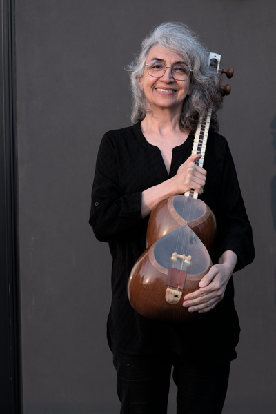 | **Tayebeh Adami - Tar** The resonant strings of the tar have been Tayebeh's musical language, refined through studies with masters Hoshang Zarif, Hoseyn Mehrani, Mehdi Hoseini, and Amir Ahadi. Her deep passion for traditional Iranian music extends beyond personal artistry to a genuine joy in sharing these ancient melodies with others. Always eager to discover new sonic territories, Tayebeh continues her musical exploration through innovative collaborations and fresh interpretations. |
| 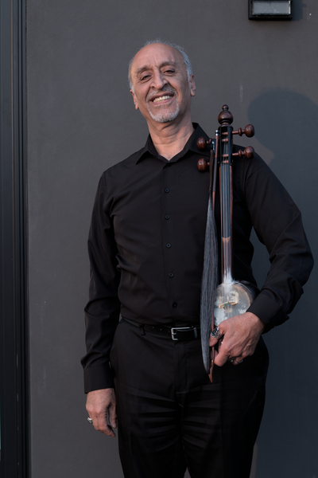 | **Faraidoun Akhavan - Violin** At twelve years old in Iran, Faraidoun discovered his musical calling and studied under Assadollah Malek, a celebrated Persian violinist and composer. His early career included performances with the Zahedan classical music orchestra before his departure from Iran in 1979. For decades in Canada, Faraidoun has served as a cultural ambassador, introducing Persian classical music to diverse audiences across various venues. In 1996, he joined forces with Douglas Hensley to establish the Darya Persian classical music ensemble in Victoria, creating a lasting legacy through countless performances that continue to bridge cultures through the universal language of music. |
| 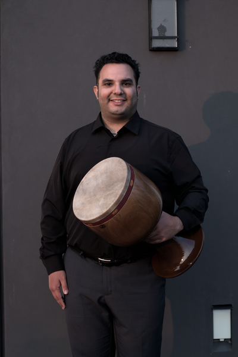 | **Arian Aminalroaya - Percussion & Vocals** Music chose Arian early—at just five years old, he began his studies under master Arjang Kamkar in Tehran, specializing in Persian percussion and vocals. This early foundation launched an international performance career that has taken him across stages with the Ancient Music Society and Duo Corvi. Since 2011, he has been an early member of the Darya Persian Music Ensemble, bringing his ear-trained musicianship and expressive artistry to explorations spanning classical, popular, and electronic Persian music. Currently pursuing business studies in digital marketing, Arian seamlessly blends traditional artistry with contemporary innovation. |
| 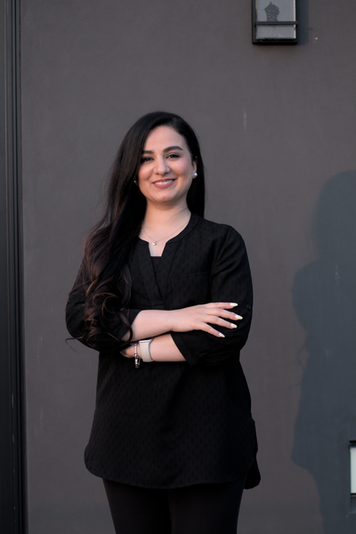 | **Maryam Badarzadeh - Vocals** Born in Tehran and now calling Victoria home, Maryam has nurtured her passion for vocal performance since her teenage years. Her self-guided journey through Persian classical singing has been illuminated by the works of legendary masters, inspiring her own artistic development. During her years in Iran, she spent two enriching years collaborating with a local music ensemble. Since 2023, Maryam has found her artistic home with the Darya Ensemble, where she continues to explore the depths of Persian vocal tradition alongside accomplished musicians. |
| 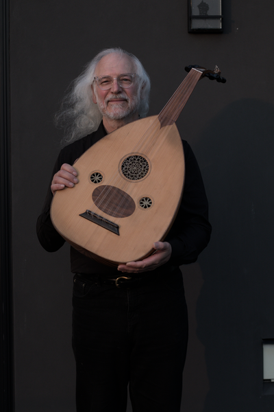 | **Douglas Hensley - Setar, Ney, Oud, santour** Bridging East and West through his musical journey, Douglas brings his foundation in classical guitar and lute to Persian music with remarkable dedication. His studies span continents and masters—learning tar with Mohammad Reza Lotfi and Dariush Tala'i, setar with Reza Ghasemi and Partow Hooshmandrad, ney with Hossein Omoumi, oud with Akbar Mohseni, and santour with Mahvash Guerami across California and Paris. A founding member of multiple ensembles including, Steluţa and Three Rivers, he is also a member of the Vancouver Inter-Cultural Orchestra, and teaches at the Victoria Conservatory of Music. |
| 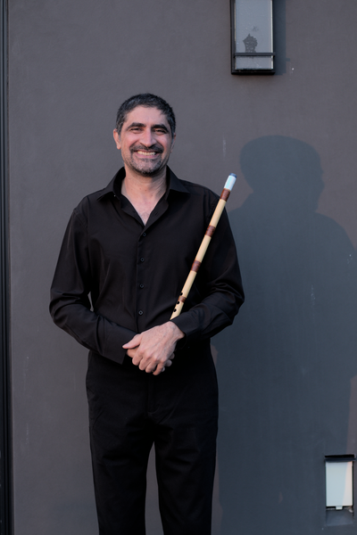 | **Davoud Jafari - Ney** Davoud's path to the ney began through friendship—learning initially alongside Abbas Adami before deepening his craft under master Yasin Azhdari, a distinguished student of the legendary Kiani Nezhad. Further studies with Hasan Nahid have shaped his expressive and emotionally rich playing style. For Davoud, the haunting voice of the ney is not merely an instrument but a vital thread woven through the fabric of his daily life. |
| 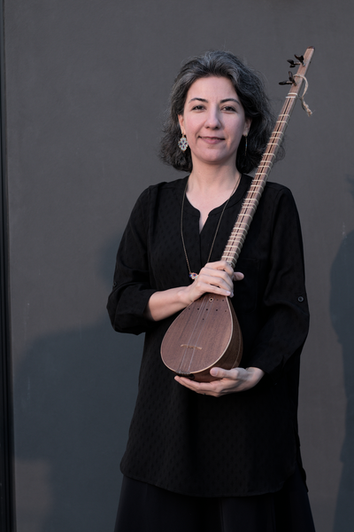 | **Azar Mirzaei - Setar** Growing up in a family steeped in Persian musical tradition, Azar discovered her calling with the setar in 2001 under the masterful guidance of Hossein Yara. After four formative years of study, life's currents led her away from formal training, though her passion never dimmed—the setar remained her companion through quiet moments of personal practice. In November 2023, Azar's artistic journey came full circle when she joined the Darya ensemble and resumed her studies with the esteemed master Houshang Farahani, embracing a renewed chapter of musical exploration. |
| 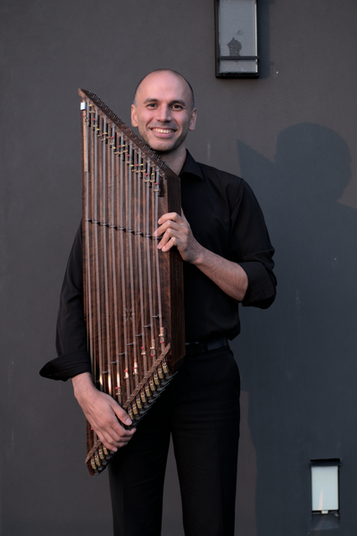 | **Keivan Monfared - Santour** Keivan's musical journey began at age seven when his aunt introduced him to the santour. Captivated by what maestro Faramarz Payvar described as this "simple yet elusive" instrument, he has been devoted to mastering its intricacies ever since. He has studied under renowned masters Hadi Jafari and Javad Bathaei, while continuing to develop his artistry through personal exploration and musical collaborations. With extensive experience performing alongside ensembles such as Nava and Chutney, Keivan brings a wealth of musical depth to his performances. As the newest member of the Darya Ensemble, Keivan is excited to share his distinctive musical voice and contribute to the rich tapestry of Persian classical music. |
| 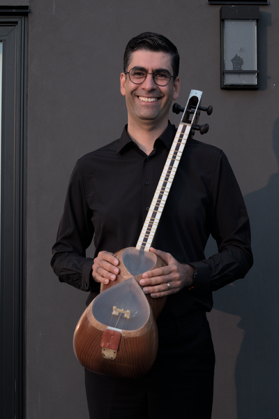 |  **Masoud Manzouri - Tar** Masoud brings his passion for the tar and deep appreciation for Persian classical music to the Darya Ensemble. His dedication to mastering this foundational instrument of Persian music reflects his commitment to preserving and sharing the rich traditions of his heritage. Through years of study and practice, Masoud has developed a nuanced understanding of the tar's expressive capabilities and continues to explore its melodic possibilities within the ensemble's collaborative performances. |
| 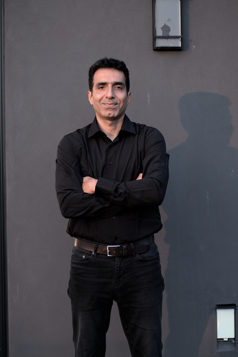 | **Mohammad Sadeghipour - Vocals** Hailing from the coastal city of Bushehr on the Persian Gulf, Mohammad's love affair with traditional Iranian vocals began in his youth. As a self-taught artist, he immersed himself in the nuances of Persian singing before joining Tehran's Arsbaran Cultural Center choir during his university years. There, he briefly studied under master Rambod Sodeif, later continuing his vocal training in Bushehr with Bahman Abdolsheikhi, one of master Sodeif's distinguished students. Since immigrating to Canada in 2022, Mohammad continues to carry the melodic traditions of his homeland across continents. |
| 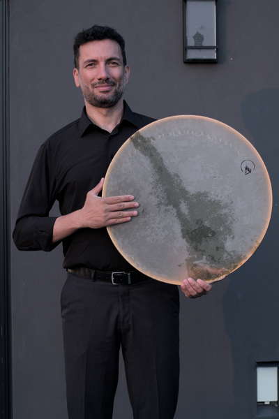 | **Ali Shirazi - Daf** Ali's rhythmic artistry on the daf adds the heartbeat to the Darya Ensemble's performances. His skilled hands bring the ancient Persian frame drum to life, weaving intricate patterns that provide the foundation for the ensemble's melodic explorations. With a deep understanding of traditional Persian rhythms and their ceremonial significance, Ali's performances create the perfect balance between meditative spirituality and celebratory energy that defines Persian classical music. |

---

*This concert features traditional Persian instruments and presents both classical masterworks and contemporary compositions in the living tradition of Iranian music.*
